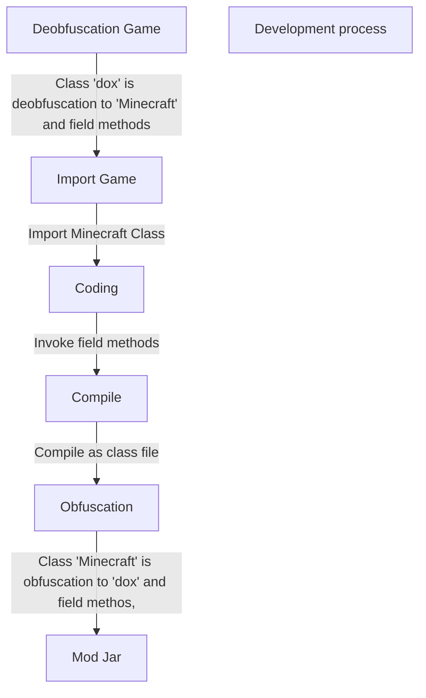

# HumbleGradle

```mermaid
graph TD
A[Deobfuscation Game] --Class 'dox' is deobfuscation to 'Minecraft' and field methods-->B[Import Game] --Import Minecraft Class-->C[Coding] --Invoke field methods-->D[Compile] --Compile as class file-->E[Obfuscation] --Class 'Minecraft' is obfuscation to 'dox' and field methos,-->F[Mod Jar]

    Z[Development process]
```
